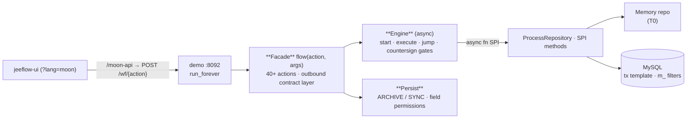

<div align="center">

# jeeflow-moon

**The jeeflow workflow engine in MoonBit — the federation's 7th language.**

[](./LICENSE)
[](https://mooncakes.io/docs/mldong/jeeflow-core)
[](https://mooncakes.io/docs/mldong/jeeflow-facade)
[](./MAINTAINING.md)

</div>

`jeeflow-moon` is a full workflow (BPM) engine — process definitions, instances, tasks,
countersign gates, CC notifications, stats — behind a **single 40+ action facade**:
`flow(action, args) → {code, msg, data}`. It is the MoonBit port of the
jeeflow federation (Java reference implementation), API-compatible with the Go / Python / Node /
PHP / Rust builds: same 16 shared LogicFlow fixtures, same `99999999` error envelope, same
five-key pagination, same state machine.



## Quickstart

```bash
git clone https://github.com/mldong/jeeflow-moon.git && cd jeeflow-moon
export MOON_HOME=<your-moon-home> PATH=$MOON_HOME/bin:$PATH

moon test --target wasm                                   # T0: 全绿（条数以本机/CI 实跑读数为准）
moon run --target wasm demo/cmd/main                      # demo on :8092 (memory store)
bash scripts/smoke_t2.sh                                  # start → todo → approve → highlight
```

> Fresh toolchain? Run `moon update` once before the first `moon test` / `moon add` — the index
> bundled with the compiler can be too old to resolve `moonbitlang/async` / moonmysql deps.
>
> Every command above carries `--target wasm` on purpose: native can't compile against
> `moonbitlang/async` on a MinGW/MSYS host (that C layer is MSVC-only on Windows) — it's the
> toolchain, not this repo. Native is still gated, just in CI; the full policy lives in
> [MAINTAINING.md](./MAINTAINING.md) §构建目标纪律.
>
> Running the demo? One instance per port, and the MySQL store needs a pre-created schema and
> ships no flows — both covered in [docs/demo.md](./docs/demo.md).

## Live demo

Already running against this exact facade (no setup needed):

- [jeeflow demo site — MoonBit tab](https://jeeflow-demo.mldong.com/?lang=moon): the shared
  [jeeflow-ui](https://github.com/mldong/jeeflow-ui) workspace, `?lang=moon` routes every
  `POST /wf/{action}` to this engine's `:8092` backend (`/moon-api/` proxy).
- API health: [moon-api/health](https://jeeflow-demo.mldong.com/moon-api/health)

Consume from your own module — `moon add` pulls the latest release, no version pin:

```bash
moon new my-flow && cd my-flow
moon add mldong/jeeflow-core     # engine core — zero runtime registry deps
moon add mldong/jeeflow-facade   # 40+ action unified facade
moon add moonbitlang/async       # flow() is async; async main needs it
# each add resolves the latest version and writes it into your moon.mod
```

`flow` is `async` and takes `Map[String, Json]`, and MoonBit resolves package aliases per
`moon.pkg` — both of those belong in your module's files, not in `moon.mod`. This is the whole
copy-paste module (verified `moon run cmd/main`, output below):

```moonbit
// cmd/main/moon.pkg
import {
  "mldong/jeeflow-core/spi" @spi,
  "mldong/jeeflow-core/memory" @memory,
  "mldong/jeeflow-core/json" @json,
  "mldong/jeeflow-facade" @facade,
  "moonbitlang/async",
}

pkgtype(kind: "executable")
```

```moonbit
// cmd/main/main.mbt — repositories are generic parameters, small SPIs are closure fields
async fn main raise {
  let repo   = @memory.MemoryRepository::new()
  let ctx    = @spi.Ctx::new(repo, repo)          // no ext repo here; NoExtRepository for MySQL
  let facade = @facade.Facade::make(ctx)
  let args : Map[String, Json] = { "processDefineId": 1, "operator": "applicant" }
  println(@json.stringify(facade.flow("processDefine/startAndExecute", args)))
}
```

```
{"code":99999999,"msg":"流程定义不存在: 1"}
```

That envelope is the point: a bare `MemoryRepository` ships **empty** — the demo's 16 shared flows
come from `seed_memory()` loading `flows/*.json` (`demo/app.mbt`), which is not part of any
published module. Feed your own definition through `processDesign/save` → `processDesign/deploy`
first, then `startAndExecute`. Add `.with_user_provider(...)` / `.with_id_generator(...)` on the
`Ctx` for real assignees and snowflakes (see [SPI guide](./docs/spi-guide.md)).

## What's here

- **40+ action facade** — every engine capability routes through `flow(action, args)` with the
  federation envelope: success `code=0`, business failure `99999999` (and nothing else), unknown
  action rejected at the top level. Groups: `processDefine` (8), `processInstance` (14, incl. 3
  stats), `processTask` (10), `processDesign` (9), `processSurrogate` (5). An outbound contract
  layer runs on every response: snake→camel keys, recursive id stringification (including plural
  id arrays — snowflakes exceed float64), `yyyy-MM-dd HH:mm:ss` times, five-key pagination
  (`pageNum/pageSize/recordCount/totalPage/rows`).
- **Fully async engine** — repository SPI, engine and facade are `async fn` end to end, one event
  loop, zero nested runtimes (MoonBit has no `block_on`; the sync-SPI + bridge shape used
  elsewhere is not portable here). Engine operations: `start`, `execute`, `jump`, `jump_to_end`,
  `jump_to_first`, withdraw — with hydrate-from-repository as a first-class step.
- **Countersign gates** — parallel (all-finish), sequential (one task at a time, full roster kept
  in task variables), ratio expressions (`#nrOfCompletedInstances==2`), and one-vote veto
  (`countersignCompletionCondition=ONE_VOTE_VETO`); soft reject via `submitType=20` sets
  `countersignDisagreeFlag` and abandons merged leftovers.
- **Events** — `TASK_CREATE` (fired after persistence, so listeners can resolve the task),
  `INSTANCE_END` (both finish and reject paths), `CC_CREATE` (per actor, id passed in the event);
  per-listener fault isolation — one bad listener never breaks the flow.
- **Metadata & handlers** — 7 built-in assignment handlers registered under their Java FQCNs
  (applicant / dept leaders / form-field / role), `EnumDictRegistry` with the 7 `wf_*` dicts,
  `HandlerRegistry`.
- **Persist** (separate module) — `PersistPostInterceptor` drives business-table writes off
  `persistMode`: **ARCHIVE** (one idempotent INSERT at end+agree, keyed by `process_instance_id`)
  or **SYNC** (INSERT at start → per-task UPDATE filtered by the target node's
  `PERMISSION_*` field rights → final-state UPDATE), with table-name safety checks.
- **MySQL repository** (separate module) — all SPI methods over the upstream pure-MoonBit
  MySQL wire client (`moonbitstack/moonmysql/client`, native + wasm host), `m_` three-segment filters, NULL-safe row hydration,
  DATETIME text normalization, and a real `BEGIN/COMMIT/ROLLBACK` transaction template
  (connection-bound via ambient single-thread context).
- **Memory repository** (in core) — the T0 store: same behavior, no I/O; row listing is
  id-ordered for deterministic tests.
- **Clock SPI** — core has no wall clock; time is injected (`set_clock`), so stats snapshots and
  `autoGenTitle` are fully deterministic under test (fixed clock = byte-stable consistency runs).
- **Zero-registry-dependency core** — `jeeflow-core` runs on the MoonBit standard library only;
  JSON, expressions, users and transactions are all SPI. Demo wiring shows the full assembly
  (`demo/app.mbt:15-42` is the minimal shape; entry `demo/cmd/main/main.mbt` is 70 lines).

## Modules

| module | mooncakes | role |
|---|---|---|
| [`core`](./core) | [`mldong/jeeflow-core`](https://mooncakes.io/docs/mldong/jeeflow-core) | model / async SPI / engine / parser / events / metadata / memory repo |
| [`facade`](./facade) | [`mldong/jeeflow-facade`](https://mooncakes.io/docs/mldong/jeeflow-facade) | 40+ action `flow(action, args)` + outbound contract layer + stats |
| [`persist`](./persist) | [`mldong/jeeflow-persist`](https://mooncakes.io/docs/mldong/jeeflow-persist) | business-table persist: ARCHIVE / SYNC + field permissions |
| [`repository-mysql`](./repository-mysql) | [`mldong/jeeflow-repository-mysql`](https://mooncakes.io/docs/mldong/jeeflow-repository-mysql) | MySQL SPI over a pure-MoonBit wire client + tx template |
| `demo` | not published | `:8092` HTTP demo + jeeflow-ui `?lang=moon` |

## Test matrix

| Tier | Command | Scope |
|---|---|---|
| T0 | `moon test --target wasm` | 全部 T0 用例: 31 compliance scenarios (c01–c31) over the shared flows, submitType matrix, event timing, outbound contracts, persist idempotency/permissions (mutation-verified); + facade-level withdraw/transfer three-tier cases (memory repo) |
| T1 | `JEFFLOW_DB_*=… moon run --target wasm repository-mysql/smoke` | real MySQL: five-key pages, hydrate, `m_` filters over SQL, tx rollback leaves no half instance, double-execute is rejected, `update_user` really in the UPDATE statement |
| T1-F | `JEFFLOW_DB_*=… moon run --target wasm demo/cmd/t1_mysql` | real MySQL over `JeeflowFacade`: withdraw (operator 硬必填 / 三条归属判据 / state 30 / `update_user` 回写 / 已完成行不改) + transfer (摘原人·加新人·三件留痕·账本只追加·不覆写 `operator` 列·doneList 不污染) |
| T2 | `bash scripts/smoke_t2.sh` | demo HTTP: start → todo → approve → state 20 → highlight → 99999999 negative |

> 上表四档在本机都跑 **wasm** 目标。**native** 目标由 CI 覆盖（见 Quickstart 那段说明）：
> `demo-deploy.yml` 两个目标都 build＋test、`native-probe.yml` 跑 native demo 全链＋`moon test --target native`、
> `publish.yml` 发版前要求 native 构建绿。条数以 CI 实跑读数为准，本表不写死数字。

## Design notes

Two MoonBit realities shaped the code, both documented in `MAINTAINING.md` (§4 decisions):

- **JSON numbers are doubles.** Snowflake ids exceed 2⁵³, so row VOs stringify ids at
  construction time and the outbound `stringify_ids` pass is a recursive safety net, not the
  first line of defense.
- **`Array::sort` on `String` mis-sorts on wasm** (calling `compare` directly is correct). The repo
  ships its own insertion sorts (`sort_strings` / `sort_i64` / `sort_int`) and uses them everywhere;
  when the toolchain is fixed the swaps are one-line.

See also `docs/integration.md` (embedding guide) and `MAINTAINING.md`
(maintainer guide: toolchain, T0–T2 testing, mooncakes release, design decisions, contract map).

## Origin

This engine is a MoonBit port. The workflow engine itself originated as the built-in
workflow module of the [mldong rapid-development platform](https://gitee.com/mldong/mldong)
(Apache-2.0, 10k+ stars on Gitee); the external contract follows the jeeflow federation's
Java reference implementation [jeeflow-java](https://github.com/mldong/jeeflow-java)
(Apache-2.0). Same fixtures, same envelope, same state machine — reimplemented in MoonBit.

## License

Apache-2.0.
